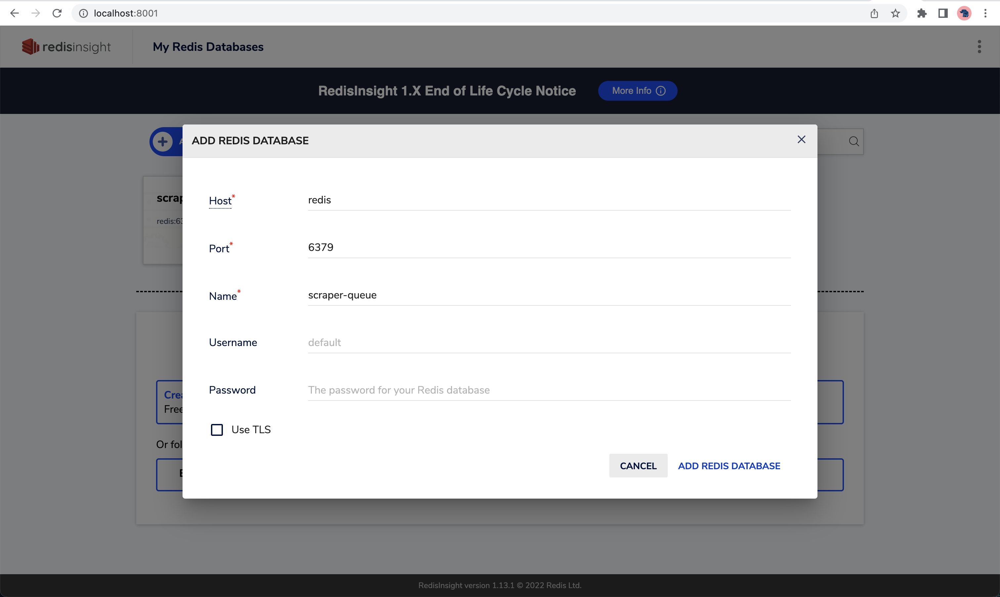

# Funding Database

## Development Redis Setup

To setup redis, run `docker-compose up` in the root directory of this repository. Then open your browser and navigate to http://localhost:8081 . This will open the Redis Insight dashboard where you will be able to view and debug your Redis database.

Enter the following configuration:
